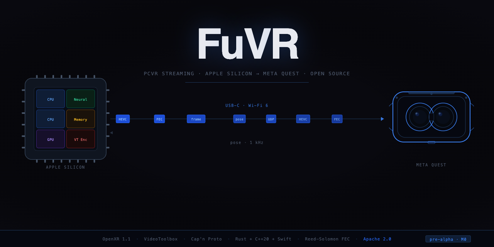
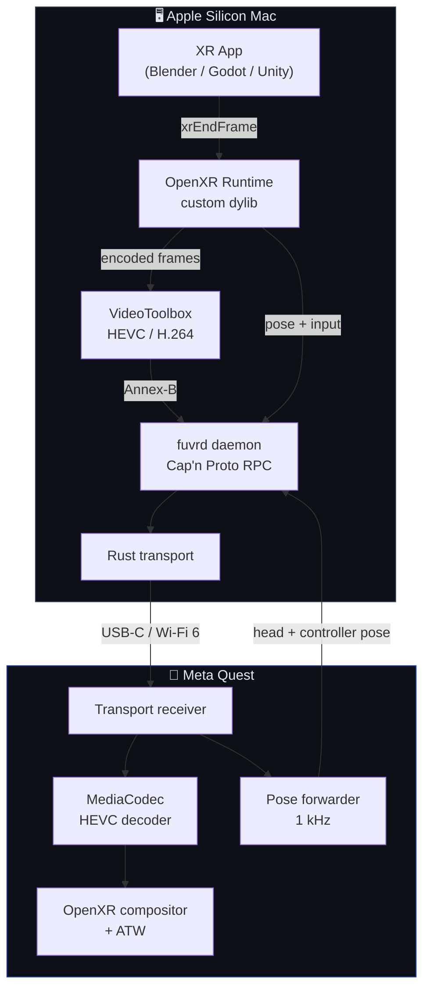

<div align="center">
  

  <br/>

  <h1>FuVR</h1>
  <p><strong>Because Apple and Meta won't talk to each other, someone had to.</strong></p>

  <p>
    
    
    
    
  </p>
</div>

---

Want to do VR on a Mac with a Quest? Cool. Meta doesn't support macOS. Apple doesn't support Quest. SteamVR on Mac was abandoned in 2020. Quest Link doesn't exist for macOS. Nobody did anything about it.

FuVR does something about it: takes an Apple Silicon Mac, builds a custom OpenXR runtime on top of it, encodes frames with VideoToolbox, blasts them to the Quest over USB-C or Wi-Fi, and gets head pose and controller input back in real time. All from scratch. No reverse engineering. No SteamVR dependency. No permission asked.

It works. Tested with Blender VR. Pull requests welcome.

---

## How it works



The hard part isn't the code — it's that Apple and Meta have had zero incentive to ever cooperate, so every piece of this stack exists *despite* them, not because of them.

---

## Quick start (Blender VR)

Plug in your Quest over USB-C, then:

```bash
./test_pipline_blender.sh
```

That's it. The script kills any stale processes, reloads the daemon via launchd, re-does `adb reverse`, restarts the Quest app, launches Blender pointed at the FuVR runtime, and auto-toggles VR Scene Inspection on. Waits 18 seconds, prints a status report.

If you want to watch what's happening:

```bash
tail -f /tmp/fuvrd.err.log                        # daemon
tail -f /tmp/blender_vr_pipeline.log              # Blender
adb logcat -s fuvr.comp fuvr.proto fuvr.drift     # Quest
```

---

## What's in here

| Path | What it does | Language |
|---|---|---|
| `proto/` | Cap'n Proto wire schemas — the frozen contract, don't touch | Cap'n Proto |
| `runtime-macos/` | OpenXR 1.1 runtime, registers as `active_runtime.json` | C++20 |
| `encoder-macos/` | VideoToolbox HEVC/H.264 low-latency encoder wrapper | C++ / Obj-C++ |
| `transport/` | USB via ADB + UDP + Reed-Solomon FEC | Rust |
| `daemon/` | The glue: encoder↔transport bridge, pose router, metrics | C++ |
| `quest-app/` | Android NDK client — receives, decodes, composites | C++ NDK |
| `mac-app/` | SwiftUI control panel — settings, status, log viewer | Swift |
| `virtual-display-helper/` | `CGVirtualDisplay` subprocess for phase 2 extended-display mode | Obj-C++ |
| `docs/` | ADRs, architecture, status | Markdown |

---

## Prerequisites

Nothing exotic, but you need all of it:

| Tool | Version |
|---|---|
| macOS | 14+ on Apple Silicon (M1 or newer) |
| Xcode CLT | 15+ |
| CMake | 3.27+ |
| Cap'n Proto | `brew install capnp` |
| Rust | stable via `rustup` |
| Android NDK | r26+ with API 33+ (Quest app only) |

---

## Build

```bash
# Schema → bindings for all targets
./scripts/gen-proto.sh

# macOS components (runtime, encoder, daemon)
cmake -S . -B build -G Ninja
cmake --build build
ctest --test-dir build          # 11/11 should pass

# Rust transport layer
cargo build --manifest-path transport/Cargo.toml
cargo test --workspace

# SwiftUI app
swift build --package-path mac-app
swift test --package-path mac-app

# Quest app (requires Android SDK + NDK)
cd quest-app && ./gradlew assembleDebug
```

---

## Roadmap

| Milestone | What | State |
|---|---|---|
| **M0 — Spike** | The four existential questions: ADB throughput, VideoToolbox latency, Quest 90 Hz decode, CGVirtualDisplay on macOS 14/15 | ✅ Done |
| **M1 — First Frame** | Full pipeline: render → encode → transmit → Quest decodes and displays | ✅ Working |
| **M2 — Interactive** | Pose loop <20 ms, controller input, stable 90 Hz | 🔧 In progress |
| **M3 — Usable** | Packaging, auto-discovery, adaptive bitrate, hand tracking | 📋 Planned |

Full technical detail in [`SPEC.md`](SPEC.md).

---

## Architecture decisions

The things that seemed obvious but weren't — full write-ups in [`docs/adr/`](docs/adr/):

| # | Decision |
|---|---|
| 0002 | OpenXR runtime runs in-process; daemon is separate and owns the encoder and transport |
| 0003 | Cap'n Proto on the Mac↔Quest wire; JSON for the local control plane |
| 0004 | `CGVirtualDisplay` in a dedicated subprocess to isolate TCC and WindowServer |
| 0005 | Reed-Solomon FEC (10, 4), no ARQ — latency budget leaves no room for retransmit |
| 0006 | USB transport via `adb reverse` — ADB tunnel, not raw USB |
| 0007 | IOSurface handoff via a parallel Mach service, not `SCM_RIGHTS` (macOS SCM_RIGHTS is fd-only) |

---

## Contributing

Read [`CONTRIBUTING.md`](CONTRIBUTING.md) before opening a PR. The patent grant in the Apache 2.0 license is intentional and non-negotiable. By contributing you agree to the Apache ICLA.

Hardware test reports, results on different headset models, and ADR proposals are more useful than anything else right now.

---

## Dev notes

> *Accurate depiction of trying to make Apple and Meta cooperate.*
>
> 

Designed and built by [Sipioteo](https://github.com/Sipioteo). [Claude Opus 4.7](https://anthropic.com) was used as a development companion throughout — sounding board, code reviewer, implementation aid. All architectural decisions, technical direction, and intellectual authorship are mine.

---

## License

Apache 2.0 — see [`LICENSE`](LICENSE).
