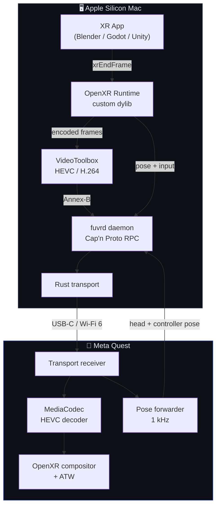

<div align="center">
  

  <br/>

  <h1>FuVR</h1>
  <p><strong>Perché Meta e Apple non si parlano, qualcuno doveva farlo.</strong></p>

  <p>
    
    
    
    
  </p>
</div>

---

Vuoi fare VR su Mac con un Quest? Bene. Meta non supporta macOS. Apple non supporta i Quest. SteamVR su Mac è abbandonato dal 2020. Quest Link non esiste per macOS. Nessuno ha fatto niente.

FuVR fa niente di tutto questo — nel senso che fa quello che tutti gli altri si sono rifiutati di fare: prende un Apple Silicon, ci costruisce sopra un runtime OpenXR custom, codifica i frame con VideoToolbox, li spara sul Quest via USB-C o Wi-Fi, e tira indietro pose e input in tempo reale. Tutto da zero. Senza reverse engineering. Senza dipendere da SteamVR. Senza chiedere permesso.

Funziona. Testato con Blender VR. Pull request benvenute.

---

## Come funziona (la versione onesta)



La parte difficile non è il codice — è che Apple e Meta non hanno mai avuto nessun incentivo a collaborare, quindi ogni pezzo di questo stack esiste nonostante loro, non grazie a loro.

---

## Quick start (Blender VR)

Collega il Quest via USB-C e:

```bash
./test_pipline_blender.sh
```

Fa tutto lui — ferma i processi vecchi, ricarica il daemon via launchd, rifa l'`adb reverse`, rilancia l'app sul Quest, apre Blender con il runtime FuVR e togola la VR Session Inspection da solo. Aspetta 18 secondi e ti dice com'è andata.

Se vuoi guardare cosa succede in tempo reale:

```bash
tail -f /tmp/fuvrd.err.log                        # daemon
tail -f /tmp/blender_vr_pipeline.log              # Blender
adb logcat -s fuvr.comp fuvr.proto fuvr.drift     # Quest
```

---

## Cosa c'è dentro

| Path | Cosa fa | Linguaggio |
|---|---|---|
| `proto/` | Schemi Cap'n Proto — il contratto wire, non si tocca | Cap'n Proto |
| `runtime-macos/` | Runtime OpenXR 1.1, si registra come `active_runtime.json` | C++20 |
| `encoder-macos/` | Wrapper VideoToolbox HEVC/H.264 low-latency | C++ / Obj-C++ |
| `transport/` | USB via ADB + UDP + Reed-Solomon FEC | Rust |
| `daemon/` | Il collante: bridge encoder↔transport, pose router, metriche | C++ |
| `quest-app/` | Client Android NDK — riceve, decodifica, compone | C++ NDK |
| `mac-app/` | Pannello di controllo SwiftUI — settings, status, log | Swift |
| `virtual-display-helper/` | Subprocess `CGVirtualDisplay` per la modalità display virtuale (fase 2) | Obj-C++ |
| `docs/` | ADR, architettura, status | Markdown |

---

## Prerequisiti

Niente di strano, ma serve tutto:

| Tool | Versione |
|---|---|
| macOS | 14+ su Apple Silicon (M1+) |
| Xcode CLT | 15+ |
| CMake | 3.27+ |
| Cap'n Proto | `brew install capnp` |
| Rust | stable via `rustup` |
| Android NDK | r26+ con API 33+ (solo per la quest-app) |

---

## Build

```bash
# Schema → binding per tutti i target
./scripts/gen-proto.sh

# Componenti macOS (runtime, encoder, daemon)
cmake -S . -B build -G Ninja
cmake --build build
ctest --test-dir build          # 11/11 dovrebbero passare

# Transport layer Rust
cargo build --manifest-path transport/Cargo.toml
cargo test --workspace

# App SwiftUI
swift build --package-path mac-app
swift test --package-path mac-app

# Quest app (serve Android SDK + NDK)
cd quest-app && ./gradlew assembleDebug
```

---

## Roadmap

| Milestone | Cosa | Stato |
|---|---|---|
| **M0 — Spike** | I quattro dubbi esistenziali: ADB throughput, latenza VideoToolbox, Quest 90 Hz, CGVirtualDisplay su macOS 14/15 | ✅ Validato |
| **M1 — First Frame** | Pipeline completa: render → encode → trasmetti → Quest decodifica e mostra | ✅ Funziona |
| **M2 — Interactive** | Pose loop <20 ms, input controller, 90 Hz stabili | 🔧 In corso |
| **M3 — Usable** | Packaging, auto-discovery, bitrate adattivo, hand tracking | 📋 Pianificato |

Dettagli tecnici in [`SPEC.md`](SPEC.md).

---

## Decisioni architetturali

Le cose che sembravano ovvie ma non lo erano — full write-up in [`docs/adr/`](docs/adr/):

| # | Decisione |
|---|---|
| 0002 | Il runtime OpenXR gira in-process; il daemon è separato e possiede encoder e transport |
| 0003 | Cap'n Proto sul wire Mac↔Quest; JSON per il control plane locale |
| 0004 | `CGVirtualDisplay` in un subprocess dedicato per isolare TCC e WindowServer |
| 0005 | Reed-Solomon FEC (10, 4), niente ARQ — il budget di latenza non lascia spazio al retransmit |
| 0006 | USB transport via `adb reverse` — tunnel ADB, non USB raw |
| 0007 | Handoff IOSurface tramite Mach service parallelo, non `SCM_RIGHTS` (su macOS funziona solo per fd) |

---

## Contribuire

Leggi [`CONTRIBUTING.md`](CONTRIBUTING.md) prima di aprire una PR. Il patent grant nella licenza Apache 2.0 è intenzionale e non negoziabile. Contribuendo accetti la Apache ICLA.

Hardware test report, risultati con headset diversi e proposte ADR sono più utili di qualsiasi altra cosa.

---

## Note di sviluppo

> *Rappresentazione realistica di me che cerco di far collaborare Apple e Meta.*
>
> 

Progetto progettato e costruito da [Sipioteo](https://github.com/Sipioteo). [Claude Opus 4.7](https://anthropic.com) ha fatto da companion durante lo sviluppo — sounding board, reviewer, aiuto implementativo. Tutte le decisioni architetturali, la direzione tecnica e la paternità intellettuale sono mie.

---

## Licenza

Apache 2.0 — vedi [`LICENSE`](LICENSE).
