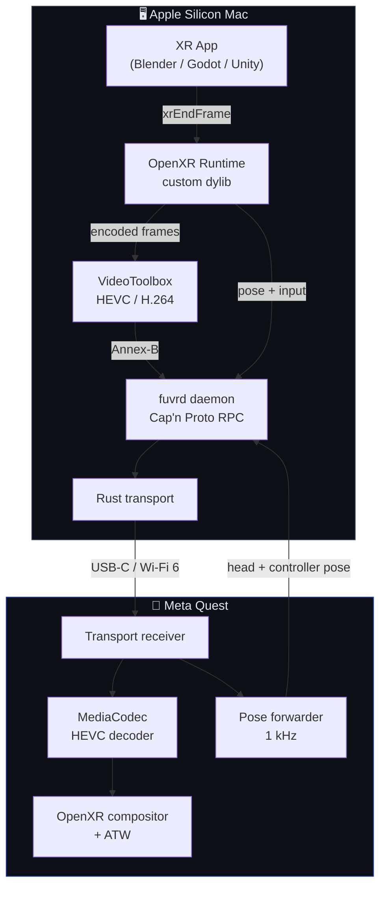

<div align="center">
  

  <br/>

  <h1>FuVR</h1>
  <p><strong>Open-source PCVR streaming from Apple Silicon to Meta Quest.</strong><br/>
  No SteamVR. No Quest Link. No reverse engineering.</p>

  <p>
    
    
    
    
  </p>
</div>

---

FuVR lets an Apple Silicon Mac render VR content and stream it to a Meta Quest headset over USB-C or Wi-Fi, with head pose, controller input, and optional hand tracking flowing back in real time. The entire stack — OpenXR runtime, encoder, transport, and Quest client — is built from scratch for macOS, where neither SteamVR nor Quest Link exist.

> **Current state:** Pre-alpha. The build system, wire protocol, and component skeletons are in place and all tests pass. Nothing streams a frame to a headset yet. See [`docs/STATUS.md`](docs/STATUS.md) for the detailed picture.

---

## How it works



---

## Repository layout

| Path | What it does | Language |
|---|---|---|
| `proto/` | Cap'n Proto wire schemas — the frozen source of truth | Cap'n Proto |
| `runtime-macos/` | OpenXR 1.1 runtime, registered as `active_runtime.json` | C++20 |
| `encoder-macos/` | VideoToolbox HEVC / H.264 low-latency encoder wrapper | C++ / Obj-C++ |
| `transport/` | USB (ADB tunnel) + UDP + Reed-Solomon FEC transport | Rust |
| `daemon/` | Host-side coordinator: encoder + transport bridge, pose router, metrics | C++ |
| `quest-app/` | Android NDK client — receiver, MediaCodec decoder, OpenXR compositor | C++ NDK |
| `mac-app/` | SwiftUI control surface — settings, status, log viewer | Swift |
| `virtual-display-helper/` | `CGVirtualDisplay` subprocess for phase 2 extended-display mode | Obj-C++ |
| `docs/` | Architecture, ADRs, status | Markdown |

---

## Prerequisites

| Tool | Version |
|---|---|
| macOS | 14+ (Apple Silicon — M1 or newer) |
| Xcode command line tools | 15+ |
| CMake | 3.27+ |
| Cap'n Proto | `brew install capnp` |
| Rust | stable (`rustup default stable`) |
| Android NDK | r26+ with API 33+ (for Quest app) |

---

## Build

```bash
# 1. Generate protocol bindings for all targets
./scripts/gen-proto.sh

# 2. macOS components (runtime, encoder, daemon)
cmake -S . -B build -G Ninja
cmake --build build
ctest --test-dir build          # 11/11 tests expected to pass

# 3. Rust transport layer
cargo build --manifest-path transport/Cargo.toml
cargo test --workspace

# 4. SwiftUI control app
swift build --package-path mac-app
swift test --package-path mac-app

# 5. Quest client (requires Android SDK + NDK)
cd quest-app && ./gradlew assembleDebug
```

---

## Roadmap

| Milestone | Description | State |
|---|---|---|
| **M0 — Spike** | Validate the four critical unknowns: ADB throughput, VideoToolbox latency, Quest 90 Hz decode, `CGVirtualDisplay` on macOS 14/15 | Tools ready, hardware runs pending |
| **M1 — First Frame** | Full pipeline: Mac renders → encodes → transmits → Quest decodes and displays | Not started |
| **M2 — Interactive** | Round-trip pose loop at <20 ms, controller input, stable 90 Hz | Not started |
| **M3 — Usable** | App packaging, auto-discovery, bitrate adaptation, hand tracking | Not started |

See [`SPEC.md`](SPEC.md) for the full architectural specification and milestone definitions.

---

## Architecture decisions

Short ADR index — full documents in [`docs/adr/`](docs/adr/):

| # | Decision |
|---|---|
| 0002 | OpenXR runtime runs in-process; a separate daemon owns the encoder and transport |
| 0003 | Cap'n Proto for the Mac↔Quest wire; JSON for the local control plane |
| 0004 | `CGVirtualDisplay` runs in a dedicated subprocess to isolate TCC interactions |
| 0005 | Reed-Solomon FEC (10, 4), no ARQ — latency budget is too tight for retransmit |
| 0006 | USB transport uses `adb reverse` over the ADB TCP tunnel |
| 0007 | IOSurface handoff uses a parallel Mach service, not `SCM_RIGHTS` (fd-only on macOS) |

---

## Contributing

Read [`CONTRIBUTING.md`](CONTRIBUTING.md) before opening a pull request. The patent grant in the Apache 2.0 license is intentional and non-negotiable. By contributing you agree to the Apache ICLA.

Issues, hardware test reports, and ADR proposals are all welcome — especially results from running the M0 spike tools on real Quest hardware.

---

## Development notes

This project was designed and built by [Sipioteo](https://github.com/Sipioteo). [Claude Opus 4.7](https://anthropic.com) was used as a development companion — sounding board, code reviewer, and implementation aid — throughout the process. All architectural decisions, technical direction, and intellectual authorship are the author's own.

---

## License

Apache License 2.0 — see [`LICENSE`](LICENSE).
